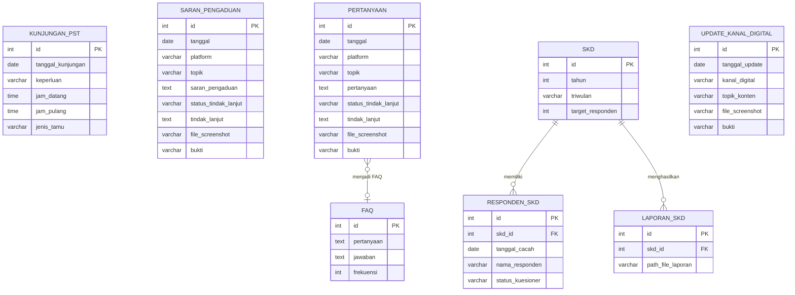

```mermaid
%%{init: {'theme': 'default'}}%%
%%{init: {'themeCSS': 'svg {background: white;}'}}%%
erDiagram

    %% =====================================================
    %% 1. KUNJUNGAN TAMU / PST
    %% =====================================================

    KUNJUNGAN_PST {
        int id PK
        date tanggal_kunjungan
        varchar keperluan
        time jam_datang
        time jam_pulang
        varchar jenis_tamu
    }


    %% =====================================================
    %% 2. SARAN / PENGADUAN
    %% =====================================================

    SARAN_PENGADUAN {
        int id PK
        date tanggal
        varchar platform
        varchar topik
        text saran_pengaduan
        varchar status_tindak_lanjut
        text tindak_lanjut
        varchar file_screenshot
        varchar bukti
    }


    %% =====================================================
    %% 3. PERTANYAAN PUBLIK
    %% =====================================================

    PERTANYAAN {
        int id PK
        date tanggal
        varchar platform
        varchar topik
        text pertanyaan
        varchar status_tindak_lanjut
        text tindak_lanjut
        varchar file_screenshot
        varchar bukti
    }


    %% =====================================================
    %% 4. FAQ
    %% =====================================================

    FAQ {
        int id PK
        text pertanyaan
        text jawaban
        int frekuensi
    }


    %% =====================================================
    %% 5. SURVEI KEBUTUHAN DATA (SKD)
    %% =====================================================

    SKD {
        int id PK
        int tahun
        varchar triwulan
        int target_responden
    }

    RESPONDEN_SKD {
        int id PK
        int skd_id FK
        date tanggal_cacah
        varchar nama_responden
        varchar status_kuesioner
    }

    LAPORAN_SKD {
        int id PK
        int skd_id FK
        varchar path_file_laporan
    }


    %% =====================================================
    %% 6. KANAL DIGITAL
    %% =====================================================

    UPDATE_KANAL_DIGITAL {
        int id PK
        date tanggal_update
        varchar kanal_digital
        varchar topik_konten
        varchar file_screenshot
        varchar bukti
    }


    %% =====================================================
    %% RELATIONSHIPS
    %% =====================================================

    PERTANYAAN }o--o| FAQ : "menjadi FAQ"

    SKD ||--o{ RESPONDEN_SKD : "memiliki"

    SKD ||--o{ LAPORAN_SKD : "menghasilkan"
```